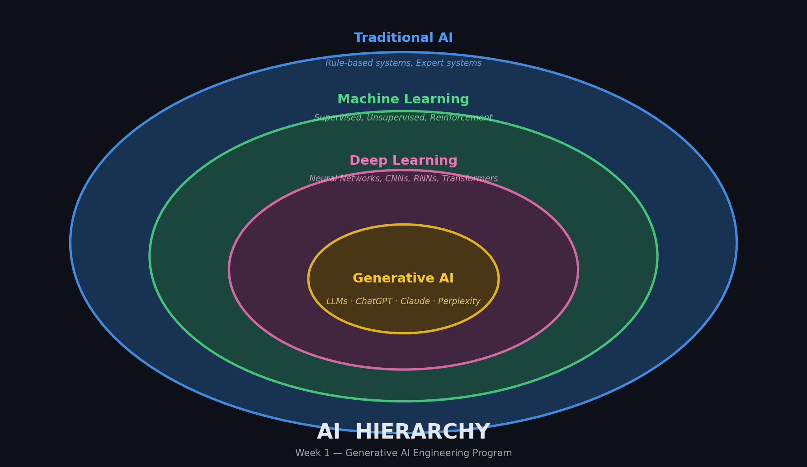

# 📖 Week 1: Program Initialization & GenAI Foundations

> **Section 3.1.1** — Generative AI Engineering Program

---

## 🛠️ Concepts & Tools Used

- VS Code
- Jupyter Notebooks
- Google Colab
- ChatGPT
- Claude
- Perplexity

---

## ✅ Tasks Executed

Initiated the Generative AI engineering program by setting up the required development environments and familiarizing with the Learning Management System. Analyzed the AI hierarchy, mapping the technical distinctions between Traditional AI, Machine Learning, Deep Learning, and Generative AI. Executed a comparative analysis of three major GenAI engines (ChatGPT, Claude, and Perplexity), specifically testing their context windows, token management, and output accuracy for coding versus text generation tasks. Concluded the week by formulating a detailed reflective analysis on the integration of GenAI in modern software development.

---

## 📸 Visual Evidence

<!-- TODO: Replace this placeholder with your actual screenshot or diagram -->

> **What to add:** A diagram illustrating the AI Hierarchy (Traditional AI → ML → DL → GenAI) **or** a screenshot comparing outputs from ChatGPT and Claude.

```markdown
<!-- Example: uncomment and update the path below -->
<!--  -->
```

---

## 💡 Key Takeaways

- Set up VS Code, Jupyter Notebooks, and Google Colab as primary development environments.
- Mapped the full AI hierarchy: Traditional AI → Machine Learning → Deep Learning → Generative AI.
- Compared ChatGPT, Claude, and Perplexity across context windows, token handling, and output accuracy.
- Reflected on how GenAI integrates into modern software engineering workflows.
