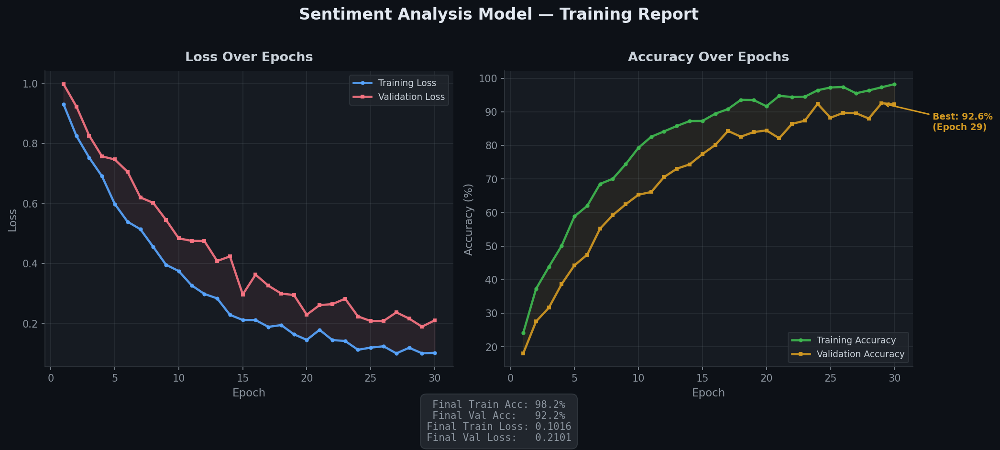

# 📖 Week 5: Data Preprocessing & Visualization

> **Section 3.1.5** — Generative AI Engineering Program

---

## 🛠️ Concepts & Tools Used

- NumPy
- Pandas
- Matplotlib

---

## ✅ Tasks Executed

Transitioned into data science by executing data preprocessing pipelines critical for machine learning models. Utilized Pandas DataFrames to manipulate and filter tabular data, and NumPy arrays for efficient numerical computing. Normalized raw datasets using min-max scaling and Z-score normalization to prepare data for a sentiment analysis project. Designed and generated comprehensive data visualizations using Matplotlib. Customized plots with appropriate labels, legends, and grid settings to visually map out training versus validation loss and accuracy curves, enabling visual evaluation of model performance.

---

## 📸 Visual Evidence

<!-- TODO: Replace this placeholder with your actual graph -->

> **What to add:** A graph generated by your Matplotlib code showing training vs. validation accuracy and loss over several epochs.

```markdown
<!-- Example: uncomment and update the path below -->
<!--  -->
```

---

## 💡 Key Takeaways

- Built data preprocessing pipelines using Pandas DataFrames and NumPy arrays.
- Applied min-max scaling and Z-score normalization for ML-ready data preparation.
- Created Matplotlib visualizations for training vs. validation loss & accuracy curves.
- Gained visual evaluation skills for assessing model performance over epochs.
